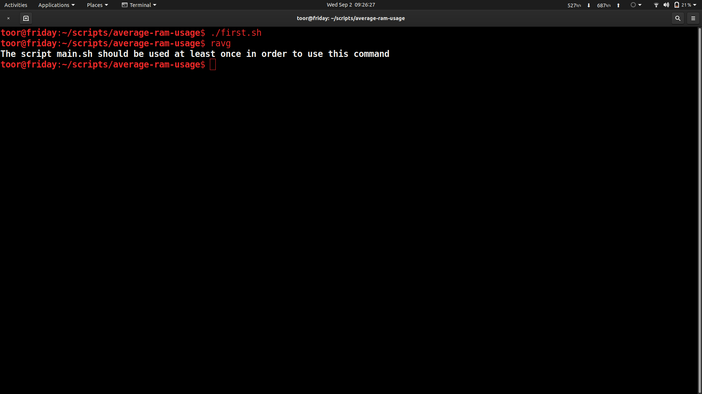
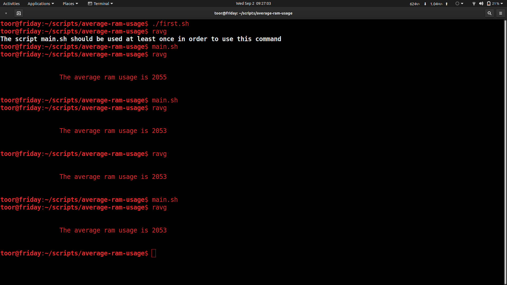

## Safe to use 
### If you want to use script from any directory 
execute ./first.sh 
#### and add the path to cron job to be executed every 5 minutes 
*/5 * * * * main.sh

### to display the average ram
and type ```ravg```

### Preview



