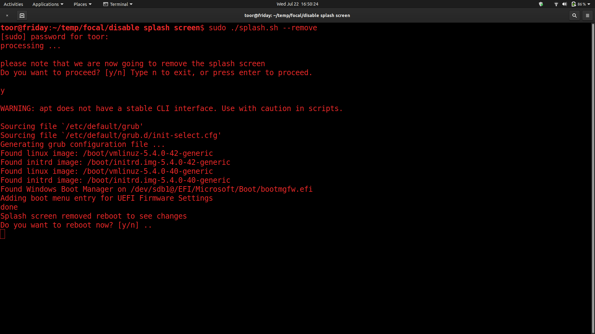
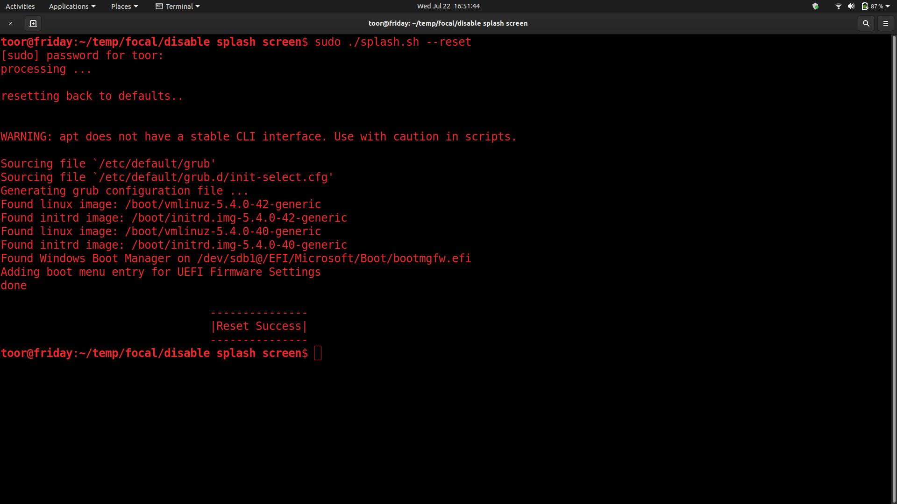

# focal splash screen removal
## Safe to use
```sh
chmod +x splash.sh
```
### To remove splash screen
```sh
sudo ./splash.sh --remove 
```


### To revert back to default 
```sh
sudo ./splash.sh --reset 
```

