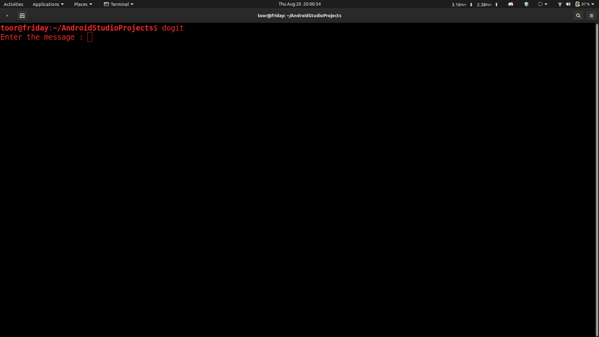

# tired of writing git commands?
## download this script and make it executable
## place it in a folder and export the folders path in .bashrc or .profile

``` export PATH=$PATH:/home/toor/.scripts ```

and now you can execute this from any directory by typing ```dogit```



